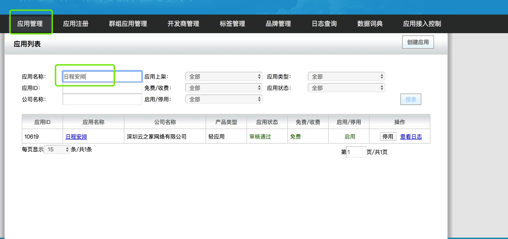
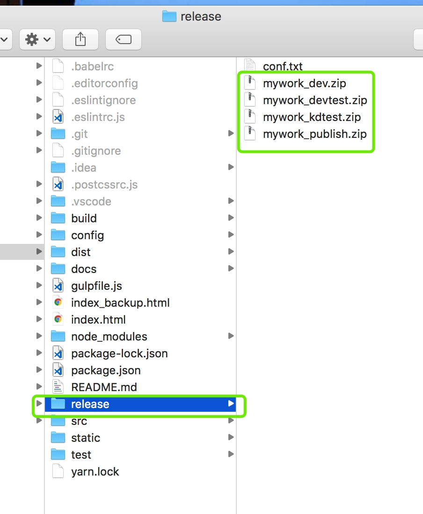

## 关于时间助手(mywork)
* 开发规范请移步[docs/STANDARD.md](./docs/STANDARD.md)，开发前请先仔细阅读开发规范
* 新员工的指引请移步[云之家前端新员工引导工程](http://172.20.10.91/webfront/team/blob/master/%E6%96%B0%E5%91%98%E5%B7%A5%E6%8C%87%E5%BC%95.md)

## Build Setup
在工程的根目录下面，先把npm拉包地址设为云之家私有仓库地址,以便拉取云之家私有npm包

```
npm set registry http://172.20.176.77:4873
```

或者可以找已经跑起工程的人直接拿到node_moudles文件夹，之后可以运行相应的指令，把工程跑起来

``` bash
# install dependencies
yarn install

# serve with hot reload at localhost:8800
npm run dev

# build for production with minification
npm run build

# build for production and view the bundle analyzer report
npm run build --report

# run unit tests
npm run unit

# run e2e tests
npm run e2e

# run all tests
npm test
```

For detailed explanation on how things work, checkout the [guide](http://vuejs-templates.github.io/webpack/) and [docs for vue-loader](http://vuejs.github.io/vue-loader).

由于使用`yarn`作为包管理工具，如果没安装`yarn`，请[点此查看如何安装](https://yarnpkg.com/zh-Hans/docs/install)，[点此阅读命令文档](https://yarnpkg.com/zh-Hans/docs/cli/)

**css单位换算**

```
以rem为单位，以宽度 为`375`的设计为准，以测量的设计稿的宽度 px，换算公式：rem = px * 0.01；
如测得的字体大小是12px 则表示为rem为，.12rem
```

## 调试

开发调试推荐使用模拟器
* 在Mac上，确认安装了Xcode，然后新建一个简单的ios工程，把工程跑起来，就会启动模拟器。安装成功后可以跟同事要云之家ios测试包

* window下面，下载安卓的模拟器，然后下载最新的测试包

## 不同环境打包
在发dev、devtest、kdtest移动端测试的时候，需要进行离线包的打包和发包

* dev 离线包上传链接： http://192.168.22.144/appsys/pages/index.jsp

* kdtest 离线包上传链接： https://kdtest.kdweibo.cn/appsys/pages/index.jsp

账号和密码均为：`root`  `kingdee2011`

登陆后，在应用`管理页签`，应用列表的应用名称下面输入`日程安排`点击搜索，搜索出来后，进入日程安排。



在页签中选择`混合应用管理`，进行相应的上传配置


配置完成后点击提交，提交成功，点击右边的生效

## 离线包打包
目前测试环境的打包方式是在命令行工程根目录下面运行命令`npm run zip`，
会生成`release`目录，会在release目录下面生成对应环境的离线包，在相应的环境发包的时候选择对应的离线包就可以了，如图

